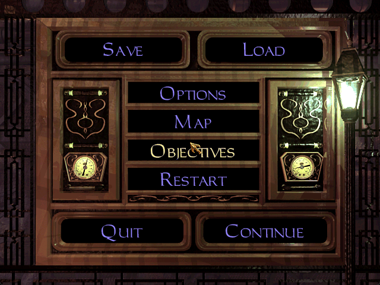
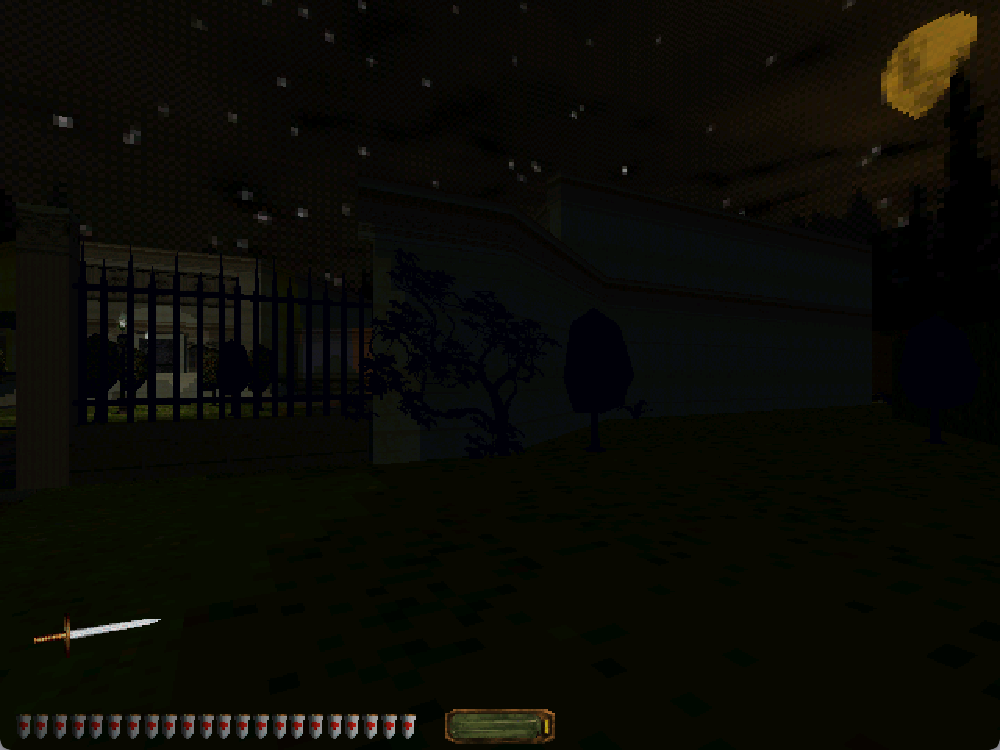
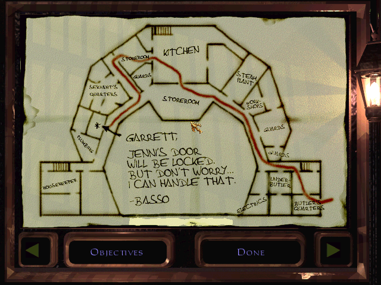

# Dark Engine / Thief 2 runner

This repository restores the historical Dark Engine sources as a Visual
Studio 2022 project and builds a Thief 2 executable with a small game-data
runner and an in-game command console.

The repository does not include Thief 2 missions, movies, sounds, scripts, or
other retail assets. A legally obtained installation of *Thief II: The Metal
Age* is required to run the game.

## Current status

The Release/x86 solution builds successfully with the Visual Studio 2022 v143
toolset. The executable can use an external retail Thief 2 installation and
retains the standard startup sequence, mission loading, game UI, inventory,
and automap.

The runner currently provides:

- first-run selection and validation of a Thief 2 data directory;
- reuse of the selected directory on later launches;
- native display-resolution defaults when the user has not configured a
  resolution;
- borderless fullscreen and resizable windowed presentation;
- the standard splash/startup, intro movie, and main-menu flow; and
- a configurable in-game command console, defaulting to backslash when free.

## Requirements

- 64-bit Windows 10 or Windows 11 capable of running 32-bit applications
- Visual Studio 2022 or Visual Studio 2022 Build Tools
- The **Desktop development with C++** workload, including:
  - MSVC v143 x86 build tools
  - a Windows 10 or Windows 11 SDK
  - MASM support installed with the C++ toolchain
- A retail Thief 2 installation containing `cam.cfg` and either `DARK.GAM` or
  `MISS1.MIS`

The legacy DirectX headers and import libraries still needed by engine-facing
interfaces are under `3rdparty/dx7sdk`. Current Windows output uses a D3D11
swap chain and Windows Media Foundation. The build target is 32-bit x86.

## Build instructions

### Visual Studio

1. Open `thief2.sln` in Visual Studio 2022.
2. Select the `Release` configuration and `x86` solution platform.
3. Build the solution with **Build > Build Solution**.
4. The resulting executable is `Release\Thief2.exe`.

`Directory.Build.props` selects the Thief 2 target by default and applies the
packing and C-language compatibility settings required by the legacy code.

### Developer Command Prompt

From an **x86 Native Tools Command Prompt for VS 2022**, run:

```bat
msbuild thief2.sln /m /t:Build /p:Configuration=Release /p:Platform=x86
```

The command should finish with `Release\Thief2.exe`.

## Run instructions

1. Start `Release\Thief2.exe`.
2. On the first launch, select the root of the Thief 2 installation. This is
   the directory containing `cam.cfg` and `DARK.GAM` or `MISS1.MIS`.
3. The runner changes the working directory to the selected installation and
   starts the engine. Retail data is read in place and is not copied into this
   repository.
4. The normal startup flow continues through the splash/startup screen, intro
   movie, and main menu.

The selected directory is stored for the current Windows user at:

```text
HKCU\Software\OpenDarkEngine\Thief2\GameDataPath
```

If the stored directory no longer contains valid game data, the runner asks
for a new directory. To choose a different directory while the old one is
still valid, remove the `GameDataPath` value with Registry Editor and launch
the executable again.

If `screen_size` or `game_screen_size` is already defined in `cam.cfg`, that
size is retained when the display driver supports it. Otherwise, the game
uses the closest supported mode to the native resolution of the display under
the mouse pointer at startup. The Video Options list merges the active
monitor's current Windows display modes with compatibility render sizes,
including 640x480, 800x600, and widescreen equivalents that fit on that
display. Resolutions are listed with the highest first; use the arrow buttons
or mouse wheel to reach lower entries such as 640x480 and 800x600.
Unsupported 24/32-bit NewDark settings are normalized to the engine's 16-bit
internal canvas. That canvas is converted to 32-bit color and presented by
D3D11; Windows is not switched into an obsolete 16-bit display mode. The
engine's gamma setting is applied by the D3D11 presentation shader using the
same power curve as the legacy palette correction.

The Video Options screen includes a **Display Mode** toggle. **Fullscreen**
uses a borderless window on the current display. **Windowed** uses a normal,
resizable window. Resolution and display-mode changes are applied when
**Done** is selected. The same setting can be changed in `cam.cfg` with
`game_full_screen 1` or `game_full_screen 0`.

On a multi-monitor system, the display containing the game window determines
both the resolution list and the target for borderless fullscreen. To change
displays, switch to Windowed, move the game window to the other display,
reopen Video Options, and then select a resolution or Fullscreen. The list is
queried again for that display; it is not assumed that every connected
display supports the same modes.

The retail game writes `skip_intro` after the intro has played. Add
`always_play_intro` to `cam.cfg` to show the intro on every launch. When the
retail movie directory contains both formats, the runner uses the H.264 MP4
through Windows Media Foundation instead of requiring the obsolete Indeo 5
codec used by the original AVI.

## In-game console

The console appears as **Console** under **Options > Controls > Customize
Controls**. It defaults to backslash (`\`) when that key is free and no console
binding already exists. It can be rebound like any other control, and the
selection is saved in `user.bnd`.

The console pauses gameplay while open. Press **Enter** to run a command and
keep the console open. Use the **mouse wheel**, the draggable scrollbar, or
**Page Up** and **Page Down** to move through its 4,096-line scrollback;
**Home** jumps to the oldest retained output and **End** returns to the newest.
Press **Escape** to close the console and resume play.

Available commands:

- `help [command]` - show built-in command help
- `openmission [number/shortname]` - start an installed mission
- `listmissions` - list installed missions and their short names
- `immunity [on/off]` - prevent player damage
- `flying [on/off]` - disable or restore player gravity
- `playerphysics [on/off]` - toggle player collision and gravity for noclip
  free-flight while leaving world physics active
- `invisible [on/off]` - toggle the existing player-invisibility property
- `reticle [on/off]` - show or hide the center reticle
- `retinfo` - describe the object and mesh under the reticle
- `listscripts` - list loaded script classes
- `debugscripts [on/off]` - log dispatched script messages to
  `script-debug.log`

Long mission and script listings are appended to `thief-console.log`. Both log
files are ignored by Git.

## Screenshots

These captures were produced during local runtime verification with external
retail game data. The data shown in the captures is not included in the
repository.

### In-game menu



### Gameplay and inventory HUD



### Automap



## Known limitations and remaining work

- The x64 solution configurations are not supported or validated. The working
  target is Release/x86.
- Scene rasterization currently uses the engine's software renderer and a
  D3D11 presentation backend. Porting polygon and texture submission directly
  to D3D11 is still in progress; the unusable legacy Direct3D HAL is disabled
  in the Thief 2 build.
- Native-resolution, high-DPI, window resizing, and ultrawide behavior need
  testing across more GPUs and display configurations.
- Gamma correction is implemented in the D3D11 presentation path. Visual
  equivalence of shadow detail, lightmaps, and emissive-looking light-source
  textures still needs comparison against the retail renderer on additional
  displays.
- The first-run picker and startup path need clean-machine testing against the
  common CD, GOG, and Steam directory layouts.
- There is no installer or redistributable package. The executable is run
  directly from the build output and uses separately installed retail data.
- Console scrollback retains the latest 4,096 output lines; command recall is
  a separate 256-command history. Long mission and script listings are also
  written to `thief-console.log`.
- `flying` disables gravity while preserving collision. Use `playerphysics off`
  for noclip free-flight; its movement behavior still needs broader mission
  testing.
- `invisible` uses the engine's existing invisibility/render property. AI
  perception behavior has not been exhaustively verified for every mission.
- Keyboard-layout behavior for the default backslash console binding needs
  broader testing on non-US layouts.
- The full build still emits numerous warnings inherited from the legacy
  source. They require separate review before warning levels can be tightened.
- Automated runtime tests are limited because licensed retail data cannot be
  included in the repository or continuous-integration environment.

## Provenance and asset policy

The Dark Engine was developed by Looking Glass Studios and powered Thief,
Thief II, and System Shock 2. This source history originates from the publicly
circulated historical source release. Review the applicable rights and
licenses before distributing binaries. Do not use this project to distribute
copyrighted game assets.
